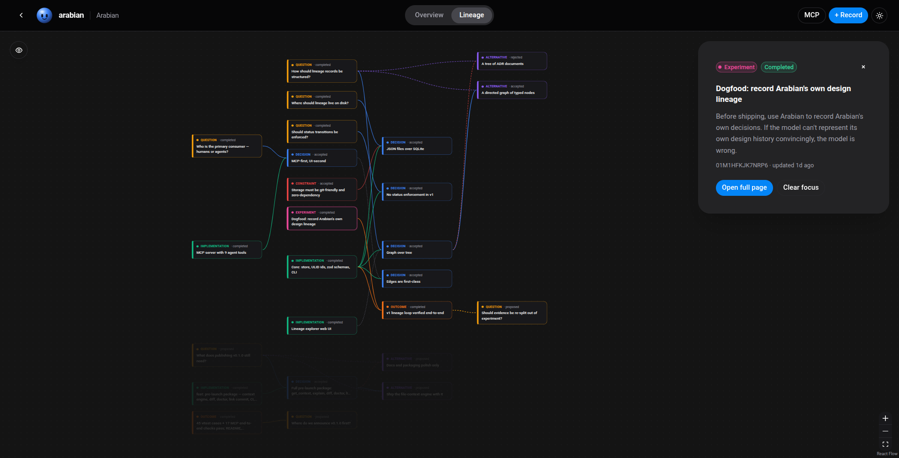
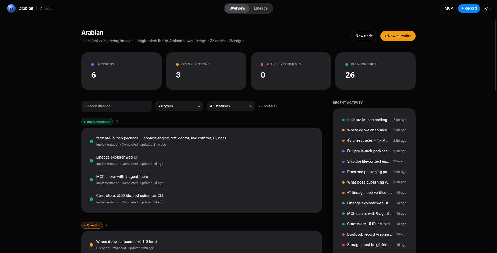

# Arabian

<p align="center">
  
</p>

**Git tells you what changed. Arabian tells you why.**

Arabian is a local-first **engineering lineage** tool. It records the chain
`question → alternatives → decision → implementation → outcome` as a directed
graph of typed nodes — stored as plain JSON in your repo, committed to git,
and queryable by humans (CLI + web UI) and by coding agents over MCP.

Six months from now, when `src/db/store.ts` makes you ask *"why on earth is
it built this way?"*, Arabian answers with the decision, the reasoning, the
alternatives that lost, and the commit that landed it.

## The 60-second version

```bash
$ arabian init                                  # .arabian/ in your repo — commit it

$ arabian add question "Postgres or SQLite?"
01J9XQ8W5N  question   Postgres or SQLite?

$ arabian add alternative "Postgres"            # and "SQLite"
$ arabian link considers 01J9XQ8W5N <postgres-id>
$ arabian link considers 01J9XQ8W5N <sqlite-id>

$ arabian add decision "SQLite for v1" -d "Zero ops, single file"
$ arabian link led_to   01J9XQ8W5N <decision-id>
$ arabian link chooses  <decision-id> <sqlite-id>

$ arabian link commit <decision-id> HEAD        # decision → code
01J9XQAB12CD "Add SQLite storage layer" implements <decision-id>
```

And when you come back to that code later:

```bash
$ arabian explain src/db/store.ts

Relevant engineering context for src/db/store.ts

[DECISION] 01J9XQ8W9K2M  SQLite for v1  accepted
  Zero ops, single file deployment.
  led to by led_to ← question Postgres or SQLite?
  leads to chooses → alternative SQLite
  alternatives considered: Postgres, SQLite
```

## Agents ask before they touch code

Arabian ships an MCP server. Configure it once:

```json
{
  "mcpServers": {
    "arabian": { "command": "npx", "args": ["-y", "arabian", "mcp"] }
  }
}
```

Then the killer question works:

> **You:** "What should I know before changing `src/auth/session.ts`?"
>
> **Agent:** calls `arabian_get_context` and answers:
>
> ```text
> DECISION — Use Redis for sessions [accepted]
>   Single-node memory is insufficient because...
> Alternatives considered: In-memory, PostgreSQL
> Implemented by: src/auth/session.ts, src/auth/middleware.ts
> Supersedes: In-memory sessions
> ```

That's the product: not an agent-accessible graph, but something an agent
actually *wants to consult* before touching code. Run `arabian skill` in any
project to install a SKILL.md that teaches coding assistants the habit —
*check context before editing, record decisions after*.

## What it is / what it is NOT

| It IS | It is NOT |
|---|---|
| A development lineage graph | An ADR manager |
| A decision-to-code audit trail | An AI memory vector DB |
| An MCP tool for coding agents | A project management tool |
| A visual decision explorer | A chat interface |

## Why "Arabian"?

The Arabian horse is one of the oldest horse breeds in the world — and the
one whose **lineage is its claim to fame**. For thousands of years its
pedigree was memorized, recited, and passed down: every horse traceable
through recorded generations. A tool whose whole job is answering *"where
did this come from?"* could hardly be called anything else.

### The mascot: Orb

Orb is a glossy sphere with two pill eyes and a small vocabulary of moods —
you'll spot them across the UI:

| Mood | Face | Shows up as |
|---|---|---|
| Normal | ●ᴗ● | the header, empty states |
| Thinking | ●◡● | loading |
| Question | ●?● | question nodes |
| Decision | ●!● | decision nodes |
| Agent | ●◉● | entries recorded by an agent |
| Warning | ●△● | errors, constraints |
| Success | ●⌣● | outcomes |

## Install

```bash
npm install -g arabian     # node >= 18
```

Or run from source: `git clone … && npm install && npm run build`, then use
`node dist/cli/index.js` (or `npm link`).

## CLI

| Command | Purpose |
|---|---|
| `arabian init [--repo <url>]` | Create `.arabian/` (auto-detects the git origin for file links) |
| `arabian add <type> <title> [-d] [-f file:12-34] [-t tag] [--actor]` | Create a node |
| `arabian link <edge-type> <from> <to>` | Connect two nodes |
| `arabian link commit <node> <sha>` | Attach a git commit as the implementation of a node |
| `arabian explain <file...>` | Lineage recorded for file(s) — the CLI twin of `get_context` |
| `arabian diff [ref]` | Lineage changes since a git ref (default `HEAD`) |
| `arabian doctor [--check-files]` | Structural integrity check (dangling edges, bad JSON, …) |
| `arabian list / show / search / stats` | Browse |
| `arabian serve [--port 7424]` | Web UI + JSON API |
| `arabian skill` | Install the agent SKILL.md into this project |
| `arabian mcp` | Start the MCP server (stdio) |

## MCP tools

`arabian_get_context` (files → relevant lineage), `arabian_create_node`,
`arabian_update_node`, `arabian_create_edge`, `arabian_get_node`,
`arabian_list_nodes`, `arabian_get_lineage`, `arabian_search`,
`arabian_get_graph`, `arabian_supersede`.

**Design rule:** the MCP server never decides what to log — the agent (or
human) does. Arabian is a passive recorder.

## Web UI

`arabian serve` → `http://127.0.0.1:7424`

- **Overview** — stats, searchable/filterable node list, recent activity
- **Node detail** — markdown descriptions, status, tags, editable lineage, supersede flow
- **Lineage graph** — React Flow, color-coded by type, typed edges, auto-layout
- **Clickable file references** — `src/auth/session.ts:42-87` opens the exact
  spot on GitHub when the project's `repository` is known

<p align="center">
  
</p>

## Storage

```
.arabian/
  project.json        # { name, description?, repository?, createdAt }
  nodes/
    01J3X….json       # one file per node
  edges.json          # all edges in one array
```

Plain JSON, one file per node: git-diffable and reviewable in PRs, zero
dependencies, directly readable by agents and humans. IDs are ULIDs
(sortable, collision-free). Validation is Zod-based on every write; the
`triggers` edge (outcome → question) closes the lineage cycle and keeps the
graph growing organically.

### Domain model

**Node types:** `question` `alternative` `decision` `experiment`
`implementation` `outcome` `constraint`
**Statuses:** `draft` `proposed` `accepted` `rejected` `superseded`
`abandoned` `completed` (transitions are recorded, not enforced)
**Edge types:** `led_to` `considers` `chooses` `rejects` `supersedes`
`implements` `produces` `constrains` `triggers` `references`

## Dogfood

This repo tracks its own design lineage in `.arabian/` — run
`arabian serve` right here to browse the decisions behind Arabian itself.
`scripts/seed.mjs` (`npm run seed`) generates a fresh example lineage if you
want to see the machinery work from scratch.

## Development

```bash
npm install
npm run build        # core + CLI + MCP (tsup), web UI (vite)
npm test             # vitest
npm run check:mcp    # end-to-end MCP verification against the built server
```

See [CONTRIBUTING.md](CONTRIBUTING.md) and [CHANGELOG.md](CHANGELOG.md).

## License

[MIT](LICENSE)
